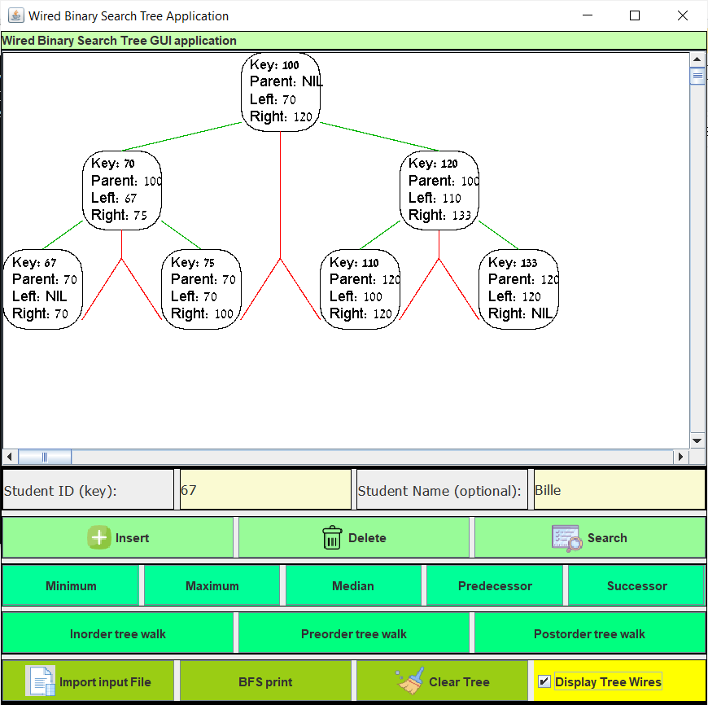
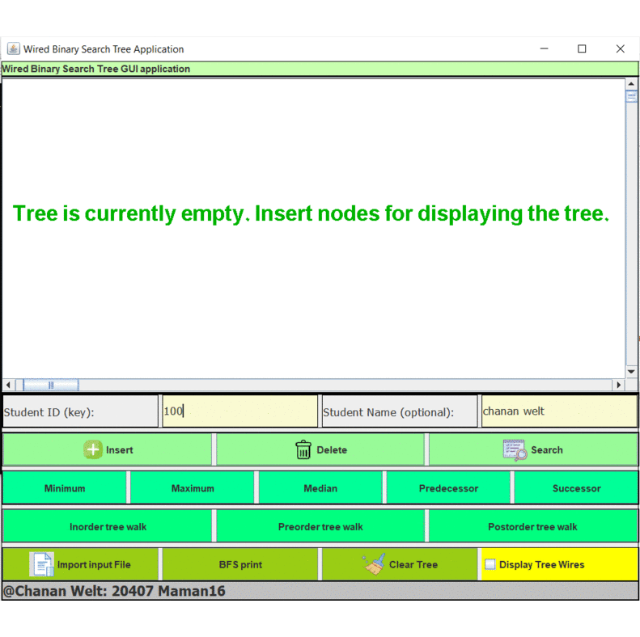
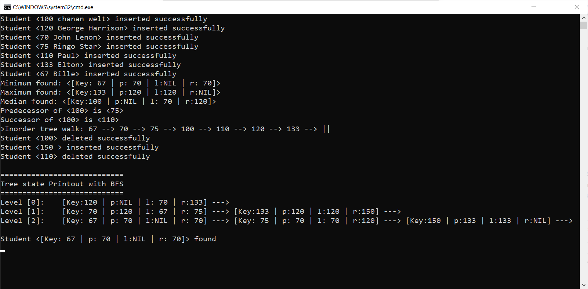

# Java-Threaded-Binary-Search-Tree    

## Brief Description
 A Java [Swing](https://en.wikipedia.org/wiki/Swing_(Java)) application which implements a [Threaded BST (Binary Search Tree)](https://en.wikipedia.org/wiki/Threaded_binary_tree) and an interactive GUI to manipulate it.
The BST in this application manages a dictionary of key-value pairs of student id's (keys) and their names (values).

## Features 
- Optional display of the **threads** in the tree, which could be either displayed (in red) or hidden:

- **Dictionary Operations** :key::
    - Insert
    - Find 
    - Remove 
- **Queries** :mag_right::
    - Maximum 
    - Minimum 
    - Median 
    - Successor 
    - Predecessor 
- **Tree Traversals** :palm_tree: : 
    - Preorder
    - Inorder
    - Postorder
    - BFS (Breadth-First-Search)
    
## Usage 
- Inorder to run application just clone or download the files and run the batch script file "**runApplication.bat**". 

- All Interaction is done through the GUI, and all output is shown on cmd & on the status bar on the app's footer, besides the BFS Travese output which is shown only on the cmd due it's length. 

- Instead of manipulating each operation separatly directly via the graphical user interface, you could alternatively upload a script input file :page_facing_up:. The format the script file is a separate line for each command. See [Input File Example](InputFileExample.txt) for a demo input file. 
The command interpreter is case in-sensitive so you could for example type either *Preorder* or *preorder*. Some commands accept no arguments, other only one argument and other two arguments, here is the entire list of commands which are allowed in a script input file, associated with their arguments (argument type & whether the argument is mandatory or not):

|    Command     |        Argument1        |        Argument2        |
|----------------|-------------------------|-------------------------|
|    Insert      | ID (Numeric, mandatory) | Name (String, optional) |
|    Delete      | ID (Numeric, mandatory) |                         | 
|    Search      | ID (Numeric, mandatory) |                         |
|    Minimum     |                         |                         |
|    Maximum     |                         |                         |
|    Median      |                         |                         |
|    Successor   | ID (Numeric, mandatory) |                         |
|    Predecessor | ID (Numeric, mandatory) |                         |
|    Preorder    |                         |                         |
|    Inorder     |                         |                         |
|    Postorder   |                         |                         |

## Demo Screenshots 

## Log Output Sample

